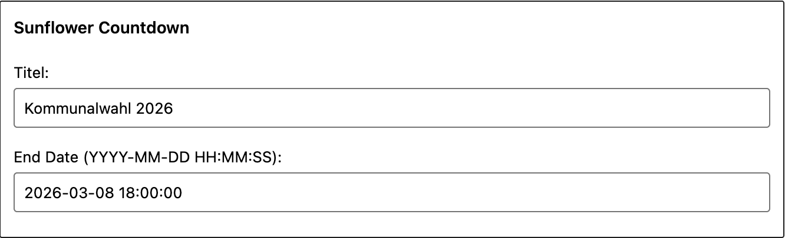
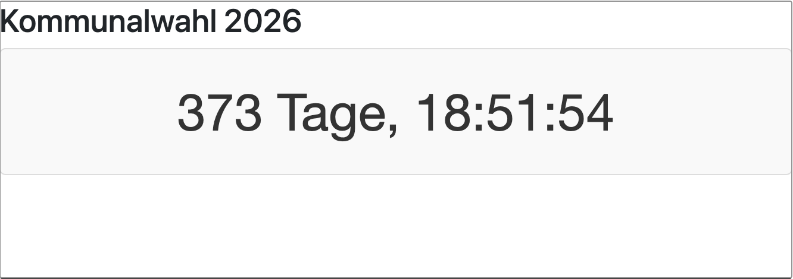
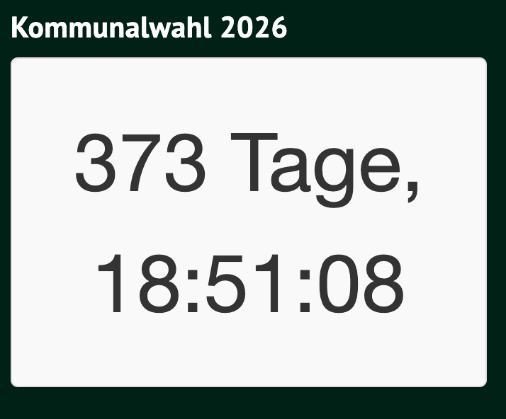

# Sunflower Countdown Plugin

Dieses WordPress-Plugin fügt einen anpassbaren Countdown-Timer als Widget hinzu, der mit dem [Design des grünen 'Sunflower'-Themes](https://github.com/verdigado/sunflower) verwendet werden kann.

## Funktionen

* Einfache Integration als Widget.
* Anpassbares Enddatum.
* Optionale Titelanzeige.
* Dynamische Anzeige des Countdowns in Tagen, Stunden, Minuten und Sekunden.
* Automatische Anpassung der Anzeige (Ausblenden von Tagen bei 0, Anzeige im Format HH:MM:SS).
* Anpassbare CSS-Stile, um das Design an das "Sunflower"-Theme anzupassen.

## Installation

1.  Lade den `sunflower-countdown`-Ordner als ZIP-Datei herunter.
2.  Melde dich in deinem WordPress-Dashboard an.
3.  Gehe zu "Plugins" -> "Installieren" -> "Plugin hochladen".
4.  Wähle die ZIP-Datei aus und klicke auf "Jetzt installieren".
5.  Aktiviere das Plugin.
6.  Gehe zu "Design" -> "Widgets" und füge das "Sunflower Countdown"-Widget zu einem Widget-Bereich hinzu.
7.  Konfiguriere das Widget mit dem gewünschten Titel und Enddatum.

## Screenshots
Screenshot in Wordpress Backend, Design->Widgets:


Vorschau Screenshot


Screenshot live



## Anpassung

* **CSS:** Passe die `css/sunflower-countdown.css`-Datei an, um das Design an dein "Sunflower"-Theme anzupassen.
* **JavaScript:** Passe die `js/sunflower-countdown.js`-Datei an, um die Countdown-Logik und die Anzeigeformate zu ändern.
* **Widget-Einstellungen:** Konfiguriere den Titel und das Enddatum des Countdowns im Widget-Bereich.

## Dateistruktur

sunflower-countdown/
├── sunflower-countdown.php
├── sunflower-countdown-widget.php
├── css/
│   └── sunflower-countdown.css
└── js/
└── sunflower-countdown.js


* `sunflower-countdown.php`: Die Haupt-Plugin-Datei.
* `sunflower-countdown-widget.php`: Die Widget-Klasse-Datei.
* `css/sunflower-countdown.css`: Die CSS-Datei für das Styling.
* `js/sunflower-countdown.js`: Die JavaScript-Datei für die Countdown-Logik.

## JavaScript Anpassung

Sollte die Anzeige von 0 Tagen nicht gewünscht sein, und stattdessen direkt die Stunden im Format HH:MM:SS angezeigt werden, kann folgender Javascript Code verwendet werden.

```javascript
jQuery(document).ready(function($) {
    $('.digital-countdown').each(function() {
        var endDate = $(this).data('end-date');
        var countdown = $(this);

        function updateCountdown() {
            var now = new Date().getTime();
            var distance = new Date(endDate).getTime() - now;

            var days = Math.floor(distance / (1000 * 60 * 60 * 24));
            var hours = Math.floor((distance % (1000 * 60 * 60 * 24)) / (1000 * 60 * 60));
            var minutes = Math.floor((distance % (1000 * 60 * 60)) / (1000 * 60));
            var seconds = Math.floor((distance % (1000 * 60)) / 1000);

            if (days > 0) {
                // Zeige Tage, Stunden, Minuten und Sekunden
                countdown.html(
                    days + (days === 1 ? ' Tag, ' : ' Tage, ') +
                    hours + (hours === 1 ? ' Stunde, ' : ' Stunden, ') +
                    minutes + (minutes === 1 ? ' Minute, ' : ' Minuten, ') +
                    seconds + (seconds === 1 ? ' Sekunde' : ' Sekunden')
                );
            } else {
                // Zeige nur Stunden, Minuten und Sekunden im Format HH:MM:SS
                countdown.html(
                    (hours < 10 ? '0' + hours : hours) + ':' +
                    (minutes < 10 ? '0' + minutes : minutes) + ':' +
                    (seconds < 10 ? '0' + seconds : seconds)
                );
            }

            if (distance < 0) {
                clearInterval(interval);
                countdown.html('EXPIRED');
            }
        }

        updateCountdown();
        var interval = setInterval(updateCountdown, 1000);
    });
});
```

## CSS Anpassung

Um das Design optimal an das verwendete Theme anzupassen, können folgende CSS Anpassungen vorgenommen werden.

```
.digital-countdown {
    font-size: 2em;
    text-align: center;
    padding: 10px;
}
/* Weitere Stile nach Bedarf */
```

## Anmerkungen
Jederzeit willkommen als Issues ;-) 